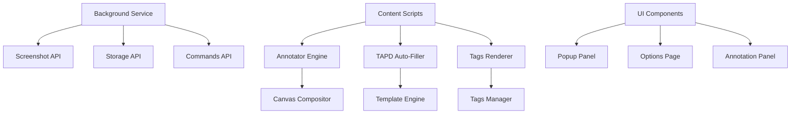

# Bug Shot Turbo (for TAPD)

<div align="center">
  <h3>🚀 一键截图标注，智能缺陷提交</h3>
  <p>专为QA工程师打造的Chrome扩展，实现"一次输入，处处复用"</p>
  
  
  
  
</div>

---

## ✨ 核心特性

### 🎯 一键标注
- **`Alt+S` 快速启动** - 任意页面秒速开启标注模式  
- **多区域框选** - 支持单页面多个问题区域标注
- **智能合成** - 自动生成带标注的高清截图

### 🤖 智能填充  
- **自动识别TAPD页面** - 切换即填，无需手动操作
- **模板化渲染** - 标题、详情智能生成
- **一键剪贴板** - 截图自动进入剪贴板，直接粘贴

### 🏷️ 标签管理
- **分类标签** - 功能、界面、性能等预设分类
- **快捷选择** - 数字键1-9快速选择常用标签
- **动态搜索** - 实时搜索标签，快速定位

### 📋 模板系统
- **可配置模板** - 自定义标题和描述格式
- **变量替换** - 支持页面URL、时间戳等动态变量
- **多域名适配** - 支持腾讯云TAPD各个域名

---

## 📦 快速开始

### 安装扩展

```bash
# 1. 打开Chrome扩展管理页面
chrome://extensions/

# 2. 开启开发者模式（右上角开关）

# 3. 点击"加载已解压的扩展程序"，选择项目目录
```

### 首次使用

1. **🔧 检查权限** - 确保扩展已获取必要权限
2. **📝 配置TAPD** - 访问设置页面，确认TAPD域名配置
3. **🎯 开始使用** - 在任意页面按 `Alt+S` 启动

---

## 🚀 使用指南

### 基础流程


### 操作详解

#### 1️⃣ 启动标注
- 在任意页面按 `Alt+S` 
- 页面出现半透明遮罩，进入标注模式

#### 2️⃣ 框选区域
- **单区域**：拖动框选→选择标签→输入描述→完成
- **多区域**：框选→标注→继续框选→标注→完成  
- **快捷键**：`Enter`确认，`Esc`取消

#### 3️⃣ 标注信息
- **标签选择**：点击预设标签或搜索自定义标签
- **问题描述**：输入具体的问题说明  
- **快捷键**：数字键1-9快速选择常用标签

#### 4️⃣ 生成截图
- 点击"完成提交"或按 `Alt+Enter`
- 自动生成带标注的截图并写入剪贴板
- 显示成功提示，可选择跳转TAPD

#### 5️⃣ TAPD提交
- 访问TAPD新建缺陷页面
- 标题和详情自动填充
- `Ctrl/Cmd+V` 粘贴截图到详情区域

---

## ⚙️ 高级配置

### 模板变量

| 变量名 | 描述 | 示例 |
|--------|------|------|
| `${issue}` | 问题描述 | "按钮点击无响应" |
| `${firstTag}` | 第一个标签 | "按钮失效" | 
| `${pageURL}` | 当前页面URL | "https://example.com/page" |
| `${pathLast1}` | URL最后一段 | "page" |
| `${timestamp}` | 时间戳 | "2024/01/06 10:30:25" |
| `${issuesSummary}` | 问题汇总(多区域) | "1. 按钮失效\n2. 样式错位" |

### 默认模板

**标题模板**：
```
${issue}（${pathLast1}）
```

**详情模板**：
```
【问题类型】${firstTag}
【问题描述】${issue}
【页面地址】${pageURL}  
【发现时间】${timestamp}

【复现步骤】
1. <在此补充>
2. <在此补充>

【期望结果】<在此补充>
【实际结果】<在此补充>

【截图附件】请参考下方截图
```

### 标签分类

<details>
<summary><b>🔧 功能类（11个）</b></summary>

- 按钮失效、表单校验、数据校验、权限控制
- 业务逻辑、流程异常、功能缺失、交互异常  
- 状态管理、消息通知、其他功能

</details>

<details>
<summary><b>🎨 界面样式类（8个）</b></summary>

- 样式错位、布局问题、颜色异常、字体问题
- 图标缺失、响应式、动画异常、其他样式

</details>

<details>
<summary><b>⚡ 性能类（3个）</b></summary>

- 加载缓慢、卡顿问题、内存占用

</details>

<details>
<summary><b>🔗 兼容性类（4个）</b></summary>

- 浏览器兼容、版本兼容、设备兼容、其他兼容

</details>

<details>
<summary><b>📡 数据接口类（5个）</b></summary>

- 接口报错、数据异常、请求超时、返回格式、其他接口

</details>

### 自定义配置

访问扩展设置页面（点击扩展图标 → 设置）：

- **🎯 TAPD配置** - 自定义表单选择器，适配不同TAPD版本
- **📝 模板配置** - 修改标题和详情模板格式  
- **🏷️ 标签管理** - 添加/编辑/删除自定义标签
- **⌨️ 快捷键** - 自定义快捷键绑定

---

## 💻 技术架构

### 核心组件



### 项目结构

```bash
bug-shot-turbo/
├── 📄 manifest.json                 # Manifest V3配置
├── 📄 CLAUDE.md                     # Claude开发指南
├── 🗂️  background/
│   └── 📄 service-worker.js         # 后台服务worker
├── 🗂️  content/
│   ├── 📄 annotator-outline.js      # 主标注引擎
│   ├── 📄 annotator-multi.js        # 多区域标注版本
│   ├── 📄 annotator-border-only.js  # 边框标注版本
│   ├── 📄 tapd-filler.js           # TAPD自动填充
│   ├── 📄 tags-renderer.js         # 标签渲染组件
│   └── 📄 annotator.css            # 标注UI样式
├── 🗂️  config/
│   ├── 📄 default-tags.js           # 默认标签配置
│   └── 📄 tags-manager.js           # 标签管理器
├── 🗂️  ui/
│   ├── 📄 popup.html/js/css         # 扩展弹窗
│   └── 📄 options.html/js/css       # 设置页面
├── 🗂️  debug/
│   ├── 📄 debugging-guide.md        # 调试指南
│   ├── 📄 test-events.js           # 测试脚本
│   └── 📄 quick-fix.js             # 快速修复
└── 🗂️  assets/
    └── 🗂️  icons/                   # 扩展图标资源
```

### 技术栈

| 技术 | 版本 | 用途 |
|------|------|------|
| **Chrome Extension** | Manifest V3 | 扩展框架 |
| **JavaScript** | ES2020+ | 核心逻辑，无框架依赖 |
| **Canvas API** | - | 截图合成与标注绘制 |
| **Chrome APIs** | Latest | Storage、Screenshot、Clipboard |
| **CSS3** | - | UI样式与动画效果 |

---

## 📊 性能与兼容性

### 性能指标

| 指标 | 目标值 | 实测值 |
|------|--------|--------|
| 🚀 面板启动时间 | < 100ms | ~80ms |
| 📸 截图合成时间 | < 150ms | ~120ms | 
| 🔄 自动填充延迟 | < 200ms | ~150ms |
| 💾 内存占用峰值 | < 50MB | ~35MB |
| 📱 响应式适配 | 100% | ✅ |

### 兼容性支持

- **🌍 浏览器**：Chrome 88+、Edge 88+、Chromium内核浏览器
- **💻 操作系统**：Windows 10+、macOS 10.15+、Linux
- **📱 设备**：桌面端、笔记本（不支持移动端）
- **🔗 TAPD版本**：腾讯云TAPD、私有化部署版本

---

## 🛠️ 故障排除

### 常见问题

<details>
<summary><b>❌ Alt+S快捷键无响应</b></summary>

**可能原因**：
- 快捷键被其他软件占用
- Content Script注入失败
- 页面权限限制

**解决方案**：
1. 检查Chrome扩展管理页面，确认快捷键设置
2. 刷新页面重新加载扩展
3. 查看开发者工具Console错误信息
4. 参考 `debug/debugging-guide.md` 详细排查

</details>

<details>
<summary><b>📸 截图生成失败</b></summary>

**可能原因**：
- 缺少截图权限
- 页面尺寸过大
- Canvas绘制异常

**解决方案**：
1. 确认扩展已获得`activeTab`权限  
2. 尝试刷新页面后重新截图
3. 检查页面是否有CSP限制
4. 查看Console中的错误日志

</details>

<details>
<summary><b>🔄 TAPD自动填充不生效</b></summary>

**可能原因**：
- TAPD页面结构变更
- 表单选择器失效
- 数据存储异常

**解决方案**：
1. 确认当前页面是TAPD新建缺陷页面
2. 检查设置中的选择器配置
3. 清除扩展存储数据重试
4. 查看控制台网络请求状态

</details>

<details>
<summary><b>📋 剪贴板粘贴异常</b></summary>

**可能原因**：
- 浏览器剪贴板权限
- Clipboard API兼容性
- 图片格式问题

**解决方案**：
1. 确认已授予剪贴板写入权限
2. 尝试手动复制图片链接
3. 使用右键"复制图片"作为备选
4. 检查浏览器版本是否支持Clipboard API

</details>

### 调试工具

- **🔍 调试脚本**：`debug/test-events.js` - 手动测试功能
- **🚀 快速修复**：`debug/quick-fix.js` - 常见问题自动修复  
- **📋 调试指南**：`debug/debugging-guide.md` - 详细排查步骤

---

## 📝 更新日志  

### v0.1.0 (2025-01-15)
- 🎉 **首个正式版本发布**
- ✨ 实现多区域标注功能
- 🤖 TAPD智能填充系统
- 🏷️ 动态标签管理
- 📸 高质量截图合成
- 🔧 继续框选按钮修复
- 🎨 UI交互体验优化

---

## 📄 许可协议

**内部工具 - 禁止外传**

此工具仅供内部团队使用，包含敏感配置信息，请勿对外分享或开源。

---

## 🤝 贡献指南

### 开发环境

```bash
# 1. 克隆项目
git clone <repository-url>

# 2. 安装依赖（如果有）
# 本项目无外部依赖

# 3. 加载到Chrome进行调试
# chrome://extensions/ -> 开发者模式 -> 加载已解压的扩展程序
```

### 代码规范

- **🎯 功能开发** - 优先考虑用户体验，代码简洁易维护
- **🐛 Bug修复** - 必须包含复现步骤和修复验证
- **📝 文档更新** - 重大变更需同步更新README和CLAUDE.md
- **🧪 测试验证** - 手动测试核心流程，确保向后兼容

### 提交规范

```bash
# 功能开发
git commit -m "feat: 添加多标签快速选择功能"

# Bug修复  
git commit -m "fix: 修复继续框选按钮数据丢失问题"

# 文档更新
git commit -m "docs: 更新README使用指南"

# 样式调整
git commit -m "style: 优化标注面板UI布局"
```

---

## 📞 技术支持

- **🐛 Bug反馈** - 创建Issue并提供详细复现步骤
- **💡 功能建议** - 描述使用场景和期望效果  
- **📖 使用帮助** - 参考本README和CLAUDE.md
- **🔧 技术交流** - 欢迎Pull Request和代码讨论

---

<div align="center">
  <p><strong>🚀 让缺陷提交更高效，让测试工作更轻松</strong></p>
  <p><i>Bug Shot Turbo - 您的QA效率助手</i></p>
</div>